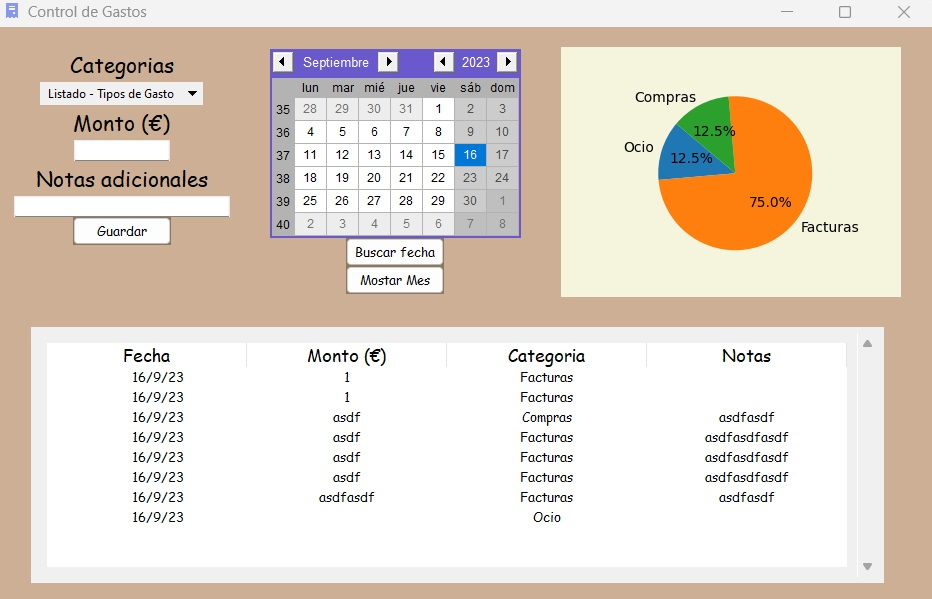

# Simple Expense Tracker



Este proyecto se realiza con el Framework de Tkinter para crear una aplicacion de escritorio que permite al usuario registrar de manera periodica los gastos que vaya realizando, asi como asignarle un concepto. Sumado a esto, la aplicacion posee un calendario en donde el usuario podra filtrar la fecha para realizar una busqueda sobre sus gastos de manera mas especifica, asi como editar o eliminar registros. Pudiendose reflejar en un pequeño grafico la relacion de sus gastos con los conceptos que los engloban.

> [!IMPORTANT]
Este proyecto es de caracter educativo y sirve para entender conceptos basicos relacionados al uso de Tkinter para la creacion de aplicaciones de escritorios con Python.

## 📂 Estructura del proyecto
```
├── LICENSE
├── README.md
├── main.py
├── requirements.txt
├── images
│   └── img.jpg
└── src
    ├── database
    │   └── expense_control.db
    ├── models
    │   └── models.py
    ├── sources
    │   └── expense_icon.ico
    └── utils
        └── db.py
```

## ⚙️ Creacion del entorno de virtual:
Se necesitara tener instalada previamente la libreria 'virtualenv', en caso contrario se podra instalar ejecutando el siguiente comando:
```
pip install virtualenv
```
Una vez instalada, para crear un entorno de desarrollo se debe ejecutar:
```
python -m virtualenv venv
```

> [!TIP]
Se recomienda la creación de un entorno virtual para optimizar el desarrollo y la ejecución del proyecto.

## 🧾 Dependencias
Este comando instala las dependencias necesarias sobre este proyecto:
```
pip install -r requirements.txt
```
Y este comando crea o actualiza el archivo txt que almacena las dependencias del proyecto:
```
pip freeze > requirements.txt  
```

> [!NOTE]
En la ubicación src/database/ se encuentra creada la BBDD en SQLite donde se almacena la informacion sobre los gastos que el usuario registra en la aplicacion. Acontinuacion se muestra el script para la creacion de la tabla.

```sql
CREATE TABLE IF NOT EXISTS record_expense (
    id INTEGER PRIMARY KEY AUTOINCREMENT,
    period DATE,
    amount INTEGER,
    category TEXT,
    note TEXT
);
```

## 📝 Contribuciones
Las contribuciones son bienvenidas. Si deseas contribuir al proyecto, por favor haz un 'fork' del repositorio, crea una rama con tus mejoras y envía un 'pull request'.

## 📄 Licencia
Este proyecto está bajo una licencia MIT. Consulta el archivo LICENSE para más detalles.
